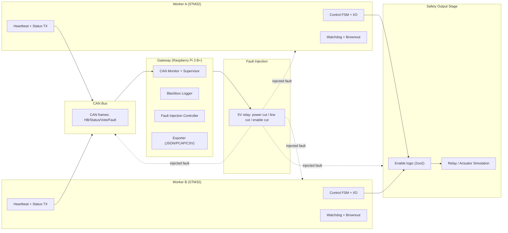

# Sentinel Dual-Control System

A safety-inspired, redundant embedded control platform intended to demonstrate **reliability engineering**, **fault tolerance**, **deterministic control**, **crash forensics**, and **system-level thinking** on real hardware.

This project is intended to grow into a “mini critical system” like those found in automotive, aerospace, and industrial equipment: multiple controllers, strict supervision rules, well-defined degraded modes, fault injection, and a blackbox-style logging pipeline.

**Current status:** Sentinel is currently in v0.1 skeleton stage. The current proof focuses on the worker state machine, explicit fault events, deterministic transitions, and documentation alignment. The larger dual-controller hardware platform remains the roadmap direction, not the current implementation.

---

## Table of Contents

- [Why this exists](#why-this-exists)
- [Sentinel v0.1 current proof](#sentinel-v01-current-proof)
- [Current proof vs future roadmap](#current-proof-vs-future-roadmap)
- [What the system does](#what-the-system-does)
- [Core principles](#core-principles)
- [System architecture](#system-architecture)
  - [High-level block diagram](#high-level-block-diagram)
  - [Roles of each node](#roles-of-each-node)
  - [Voting and safety model](#voting-and-safety-model)
- [Hardware](#hardware)
  - [Bill of materials](#bill-of-materials)
  - [Power distribution](#power-distribution)
  - [Wiring overview](#wiring-overview)
- [Software](#software)
  - [Repository layout](#repository-layout)
  - [Firmware behavior (STM32 Workers)](#firmware-behavior-stm32-workers)
  - [Gateway behavior (Raspberry Pi)](#gateway-behavior-raspberry-pi)
  - [Communication protocols](#communication-protocols)
  - [Time, determinism, and scheduling](#time-determinism-and-scheduling)
- [Safety and degraded modes](#safety-and-degraded-modes)
  - [State machine](#state-machine)
  - [Fault detection rules](#fault-detection-rules)
  - [Fail-safe outputs](#fail-safe-outputs)
- [Fault injection](#fault-injection)
  - [Planned faults](#planned-faults)
  - [How to run fault campaigns](#how-to-run-fault-campaigns)
- [Logging and crash forensics](#logging-and-crash-forensics)
  - [Blackbox event model](#blackbox-event-model)
  - [What gets logged](#what-gets-logged)
- [Build, flash, and run](#build-flash-and-run)
  - [Prerequisites](#prerequisites)
  - [Quick start](#quick-start)
  - [Firmware build and flash](#firmware-build-and-flash)
  - [Gateway setup](#gateway-setup)
- [Testing strategy](#testing-strategy)
- [Acceptance criteria](#acceptance-criteria)
- [Roadmap](#roadmap)
- [License and disclaimer](#license-and-disclaimer)

---

## Why this exists

Most portfolios show features. This project shows **responsibility**.

Sentinel is built to progressively prove we can:
- Design a system that detects failures, isolates them, and enters safe states predictably.
- Build deterministic firmware (bounded execution, watchdog discipline, timer-driven loops).
- Structure a future fault-tolerant architecture (redundancy, supervision, voting).
- Capture and explain failures with a planned blackbox logging pipeline (crash forensics).
- Run future fault campaigns (repeatable, measurable tests, not “it seems stable”).

---

## Sentinel v0.1 current proof

Sentinel v0.1 is intentionally narrow. It proves the core worker behavior before hardware integration, CAN transport, gateway services, or richer crash tooling are added.

The current proof covers:

- explicit operating states: `INIT`, `NOMINAL`, `DEGRADED`, and `FAIL_SAFE`
- defined faults: `HEARTBEAT_LOST`, `COMMUNICATION_LOST`, and `INCOHERENT_PEER_STATE`
- defined events, including `STARTUP_COMPLETE`, `HEARTBEAT_WARNING`, `COMMUNICATION_LOST`, `INCOHERENT_PEER_STATE`, `FAULT_CLEARED`, `FAULT_ESCALATED`, and `MANUAL_RESET`
- deterministic state transitions through a shared transition function
- intentional `DEGRADED` entry for recoverable or warning-level fault paths
- explicit `FAIL_SAFE` entry for escalated or safety-critical fault paths
- future observability through logs and traces, documented before full implementation

Current v0.1 reference documents:

- [v0.1 scope](docs/v0.1-scope.md)
- [state machine](docs/state-machine.md)
- [fault matrix](docs/fault-matrix.md)
- [observability](docs/observability.md)
- [supervisor simulation placeholder](gateway/supervisor-sim/README.md)

---

## Current proof vs future roadmap

Current v0.1 proof:

- worker state definitions
- event definitions
- fault definitions
- deterministic transition function
- v0.1 documentation alignment
- documentation for scope, architecture, state machine, fault matrix, and observability
- supervisor simulation placeholder

Future roadmap:

- full STM32 worker integration
- CAN communication implementation
- Raspberry Pi supervisor implementation
- hardware fault injection
- blackbox-style trace capture
- reproducible demo sequence
- richer postmortem tooling

---

## What the system does

Sentinel targets a **dual-controller** platform where two independent microcontrollers (“Worker A” and “Worker B”) run the same control logic and continuously cross-check each other.

The future Raspberry Pi gateway is intended to act as:
- Supervisor (health monitoring)
- Logger (blackbox recorder)
- Integration hub (data export, scripts, test harness)

The target system drives a “safety output” (an **Enable** line, relay, or actuator simulation) only if strict rules are satisfied. This hardware behavior is not part of the current v0.1 skeleton.

---

## Core principles

1. **Deterministic control loop**
   - Fixed control period (example: 1 kHz or 100 Hz depending on load)
   - No unbounded work inside the loop
   - Timers and bounded processing time

2. **Redundancy**
   - Two independent workers with independent clocks and resets
   - Cross-monitoring via heartbeat and status frames

3. **Fail-safe default**
   - Any uncertainty leads to safe state
   - Safe state means outputs disabled and latched until recovery policy allows re-arming

4. **Observable truth**
   - Every relevant event should become a timestamped record
   - Planned fault injection should produce traceable evidence

---

## System architecture

This section describes the target architecture for the larger Sentinel platform. It is roadmap-level context, not a claim that the current v0.1 skeleton implements the full hardware system.

### High-level block diagram



### Roles of each node

#### Worker A (STM32)

Target role:

* Runs the control loop and the safety state machine.
* Publishes:

  * Heartbeat (HB)
  * Status snapshot (mode, error flags, loop timing, supply, counters)
  * Vote/decision (ARM, DISARM, FAULT, DEGRADED)
* Consumes:

  * Peer frames from Worker B
  * Optional supervisor commands from Raspberry Pi (depending on policy)

#### Worker B (STM32)

Target role is the same as Worker A. It must be able to keep the future system safe even if A is compromised.

#### Gateway (Raspberry Pi)

Future intended role:

* Passive monitoring by default (never required for safety).
* Collects all frames and builds a timeline.
* Runs scripts to:

  * trigger fault injection
  * generate reports
  * export traces for analysis

### Voting and safety model

Default model: **2oo2 (two out of two)**

* Output is enabled only if both workers independently vote **OK to enable**.
* Any mismatch or silence disables output.

Rationale:

* 2oo2 maximizes safety demonstration: one compromised worker cannot keep the system armed alone.

Optional model (future): **1oo2 with strict supervision**

* May be introduced later to demonstrate availability vs safety tradeoffs.
* Must include explicit hazard analysis and additional checks.

---

## Hardware

Hardware integration is part of the roadmap and is not part of the current v0.1 skeleton.

### Bill of materials

Minimum target configuration:

* 2x STM32 Nucleo boards (example used: **NUCLEO-G474RE**)

  * Worker A
  * Worker B
* 1x Raspberry Pi 3 B+ (gateway + logger)
* 2x CAN transceiver modules (one per worker if not integrated)

  * Example families: MCP2551, TJA1050, SN65HVD230 (exact part depends on bus voltage and wiring)
* CAN wiring

  * Twisted pair for CANH/CANL
  * Proper termination (typically 120Ω at each end of the bus)
* Fault injection relay module (5V)

  * Used to cut power or signals in a controlled way
* Optional lab tools (recommended)

  * Logic analyzer (for timing and bus verification)
  * USB-CAN adapter (for PC capture and sanity checks)

Optional expansions (explicitly not required for the future hardware demo):

* Sensors (temperature, presence, etc.)
* External safety output stage (relay driver, MOSFET, isolated IO)
* Dedicated power monitoring IC

### Power distribution

Recommended approach for clarity and reproducibility:

* A dedicated 5V supply rail for:

  * Raspberry Pi (stable 5V, adequate current)
  * Relay module
* Workers powered via:

  * Nucleo USB (simplest for the future hardware demo), or
  * a shared regulated 5V rail if you want to demonstrate power domain coupling and brownout behavior

Safety note:

* Do not use the Raspberry Pi 5V pin as a casual power source for everything unless you know current budgets and wiring quality.

### Wiring overview

Typical minimal wiring (conceptual):

* CAN bus:

  * Worker A CANH/CANL -> Bus
  * Worker B CANH/CANL -> Bus
  * Raspberry Pi via CAN interface (SPI CAN controller like MCP2515, or USB-CAN)
* Safety output:

  * Worker A Enable GPIO -> Enable logic input A
  * Worker B Enable GPIO -> Enable logic input B
  * Enable logic -> relay driver / actuator simulation
* Fault injection relay:

  * Relay controlled by Raspberry Pi GPIO
  * Relay contacts wired to cut one of:

    * Worker A power
    * Worker B power
    * CANH or CANL segment
    * Enable line

Exact pin numbers depend on your chosen boards and CAN interface. Keep them in `docs/wiring.md`.

---

## Software

### Repository layout

This repo is structured to keep firmware, gateway, tooling, and documentation cleanly separated.

Target layout:

```text
.
├─ docs/
├─ firmware/
│  ├─ worker-common/
│  ├─ worker-a/
│  ├─ worker-b/
│  └─ tools/
│     ├─ openocd/
│     └─ scripts/
├─ gateway/
│  ├─ sentinel-gw/
│  └─ tools/
│     ├─ capture/
│     ├─ replay/
│     └─ report/
├─ tools/
│  ├─ faultctl/
│  ├─ trace/
│  └─ ci/
├─ cad/
│  ├─ enclosure/
│  └─ wiring/
├─ .github/
│  └─ workflows/
├─ LICENSE
└─ README.md
```

### Firmware behavior (STM32 Workers)

This section describes the intended STM32 worker behavior. The current v0.1 proof covers the common state, event, fault, and transition definitions rather than full board integration.

Each future worker implements the same core modules:

* **Boot and self-test**

  * Reset reason capture
  * Basic sanity checks (clock, critical peripherals)
  * Initialize event log ring buffer
  * Enter `INIT` with outputs disabled by default

* **Control loop**

  * Timer-driven tick
  * Reads local inputs (optional)
  * Updates FSM
  * Publishes heartbeat and status on CAN at fixed rates
  * Drives a local vote output (Enable GPIO)

* **Supervision**

  * Watchdog service only when:

    * loop timing is within bounds
    * internal state is valid
  * Peer monitoring:

    * expects Worker peer HB at a defined interval
    * checks peer sequence counter monotonicity
    * checks peer mode consistency

#### Canonical periodic rates (example)

These are placeholders that you should tune and lock down:

* Control loop: 100 Hz or 1 kHz (pick based on what you want to demonstrate)
* Heartbeat: 10 Hz
* Status: 5 Hz
* Vote frame: 10 Hz or on change
* Fault frame: immediate on fault detection

Keep them defined in one place:

* `firmware/worker-common/include/sentinel_config.h`

### Gateway behavior (Raspberry Pi)

The future gateway is intended as a set of services:

* `sentinel-can-listener`

  * Reads CAN frames
  * Timestamps frames at ingestion
  * Writes them to an append-only log

* `sentinel-supervisor`

  * Derives system health from observed frames
  * Detects mismatches and missing heartbeats
  * Optionally commands fault injection sequences

* `sentinel-faultctl`

  * Controls relay lines via GPIO
  * Enforces guardrails (rate limits, arming requirements)

* `sentinel-export`

  * Converts raw logs to:

    * JSON events
    * CSV summaries
    * PCAP-like representations (if needed)

All gateway processes must:

* never block CAN ingestion
* degrade gracefully if storage is full
* rotate logs safely

### Communication protocols

CAN communication is planned roadmap work. Future CAN frames must be documented and stable.

A recommended frame set:

* HB (Heartbeat)

  * node_id
  * seq
  * mode
  * uptime_ms (optional)
* STATUS

  * error_flags bitfield
  * last_loop_us
  * min/max loop time (rolling window)
  * supply voltage (if available)
* VOTE

  * enable_request (0/1)
  * reason_code
* FAULT

  * fault_code
  * fault_context (optional)
  * latch flag

Define IDs and payloads in:

* `docs/architecture.md` and `firmware/worker-common/include/can_protocol.h`

### Time, determinism, and scheduling

Future workers:

* No dynamic allocation in the control loop
* No unbounded I/O in the control loop
* Any logging in loop uses ring buffer and deferred flushing if needed

Future gateway:

* CAN ingestion is single responsibility
* Heavy processing happens offline or in separate processes

---

## Safety and degraded modes

### State machine

Every worker uses the same high-level FSM:

* `INIT`
* `NOMINAL`
* `DEGRADED`
* `FAIL_SAFE`

The current v0.1 proof scope uses only these four states. Older or future modes such as `BOOT`, `SAFE`, `ARMING`, `ARMED`, and `FAULT_LATCHED` are not part of the v0.1 worker state machine.

Document the exact transitions in `docs/state-machine.md`.

### Fault detection rules

The current v0.1 fault set is documented in `docs/fault-matrix.md`. The target platform may add detection rules such as:

* Missed peer heartbeats beyond threshold
* Peer sequence counter regression or stalls
* Incoherent peer state between Worker A and Worker B
* Local loop time overrun
* Watchdog near-miss counters
* Brownout or reset anomaly
* CAN bus-off (if applicable)

### Fail-safe outputs

Target output policy:

* Output enable is **asserted only** when:

  * local FSM is `NOMINAL`
  * peer state is coherent with `NOMINAL`
  * no faults latched
  * timing health is good
* Otherwise output is OFF

---

## Fault injection

Physical fault injection is roadmap-level work and is not part of the current v0.1 skeleton.

### Planned faults

Fault injection is intended to be a first-class feature, not an afterthought.

Examples:

* Cut power to Worker A
* Cut power to Worker B
* Break CAN line segment
* Force enable line low
* Introduce delayed or dropped frames (future: via gateway replay or bus tool)

### How to run fault campaigns

A future “campaign” is:

* a scripted sequence of injected faults
* with expected outcomes
* producing an evidence bundle (logs + summary report)

See:

* `docs/test_campaigns.md`

---

## Logging and crash forensics

The current v0.1 proof documents future observability expectations. Full blackbox-style trace capture and richer postmortem tooling are roadmap items.

### Blackbox event model

The target logging model should answer:

* What happened
* In what order
* With what timing
* What the system believed
* What it decided

### What gets logged

Future gateway logs:

* Every CAN frame with timestamp
* Derived events:

  * “Worker A missed heartbeat”
  * “Vote mismatch”
  * “System disarmed due to rule X”

Future workers log locally (ring buffer):

* State transitions
* Fault latches and reasons
* Timing overruns

Planned export formats:

* Raw binary log (fast, compact)
* JSON event timeline (human-readable)
* CSV summaries (metrics)

---

## Build, flash, and run

These steps describe the intended hardware demo workflow. They are not part of the current v0.1 skeleton proof.

### Prerequisites

Firmware:

* ARM GNU Toolchain (`arm-none-eabi-gcc`)
* CMake + Ninja (if using CMake-based build)
* OpenOCD and ST-Link tools (or STM32CubeIDE)
* Python 3 (for helper scripts)

Gateway:

* Raspberry Pi OS Lite
* CAN interface drivers (MCP2515 over SPI or USB-CAN)
* Python or C++ runtime depending on gateway implementation

### Quick start

Planned hardware demo flow:

1. Wire the CAN bus and verify termination.
2. Flash Worker A and Worker B firmware.
3. Bring up Raspberry Pi gateway and verify it sees CAN traffic.
4. Run baseline: no faults, stable `NOMINAL`.
5. Trigger fault injection and verify the documented `DEGRADED` or `FAIL_SAFE` transition and logged evidence.

### Firmware build and flash

This section is intentionally generic. Lock it down once your toolchain is finalized.

Example flow:

* Build:

  * `cmake -S firmware/worker-a -B build/worker-a -G Ninja`
  * `cmake --build build/worker-a`
* Flash:

  * `openocd -f interface/stlink.cfg -f target/stm32g4x.cfg -c "program build/worker-a/worker-a.elf verify reset exit"`

Repeat for Worker B.

### Gateway setup

Future Raspberry Pi gateway setup:

1. Enable required interfaces (depends on CAN hardware)

   * SPI if using MCP2515
2. Bring up CAN network interface

   * `ip link set can0 up type can bitrate 500000`
3. Start gateway processes using the selected service runner

   * `sentinel-can-listener`
   * `sentinel-supervisor`
4. Validate ingestion

   * check logs directory
   * confirm heartbeat frames appear at expected rate

---

## Testing strategy

The current v0.1 proof is centered on deterministic worker state-machine behavior. The broader project is intended to test at four levels:

1. **Unit tests**

   * pure logic: FSM transitions, vote rules, fault rules
2. **On-target tests**

   * timing constraints, watchdog behavior, bus stability
3. **Integration tests**

   * dual worker agreement, mismatch handling, arming rules
4. **Fault campaigns**

   * scripted power cuts, bus interruptions, enable cuts
   * must produce stable, repeatable outcomes

---

## Acceptance criteria

The future hardware demonstrator will be considered acceptable when:

* Both workers start in `INIT` with outputs disabled by default.
* Both workers produce heartbeat and status frames at stable rates.
* System enters `NOMINAL` only when both are healthy and consistent.
* Mandatory injected faults follow the documented `DEGRADED` or `FAIL_SAFE` transition paths within the defined bound.
* Gateway produces a report showing:

  * timestamps
  * detected fault
  * resulting disarm event
  * recovery behavior
* At least one fault campaign is fully reproducible with identical expected outcomes.

---

## Roadmap

Near-term:

* Lock CAN protocol IDs and payloads
* Add formal timing budget and measure loop jitter
* Add structured fault codes and a fault taxonomy
* Add replay tool to reproduce traces deterministically

Mid-term:

* Add optional 1oo2 availability mode (with explicit hazard analysis)
* Add hardware PCB for clean wiring and repeatable demo setup

Long-term:

* Add “postmortem pack” generator: one command to export logs, plots, and narrative
* Add additional fault models: stuck-at GPIO, corrupted payload, delayed frames
* Add formal verification or model checking on the FSM (select critical properties)

---

## License and disclaimer

This project is for educational and demonstration purposes.
It is not a certified safety product and must not be used to control real hazardous machinery without proper engineering process, certification, and safety validation.

See `LICENSE`.
