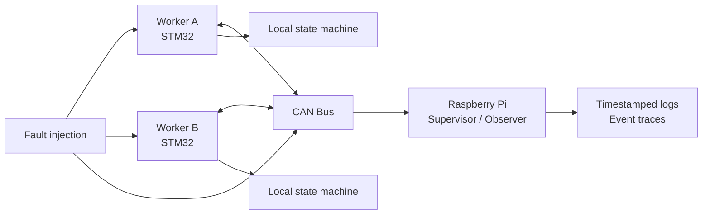

# Sentinel v0.1 Architecture

## Purpose

This document defines the minimal architecture for Sentinel v0.1.

The architecture exists to support one proof: a small distributed embedded system can detect abnormal behavior, decide deterministically, enter degraded or fail-safe states, and expose what happened through observable traces.

## System overview

Sentinel v0.1 uses a narrow dual-worker architecture:

- Worker A: STM32 controller
- Worker B: STM32 controller
- Supervisor: Raspberry Pi observer
- Communication link: CAN bus between workers
- Observability path: supervisor-side logs or traces
- Fault injection: simple controlled fault triggers

The Raspberry Pi is an observer and proof node. It is not required to keep the system safe.

## High-level diagram

## Worker responsibilities

Each STM32 worker is responsible for:

- maintaining its local operating state
- publishing heartbeat messages
- publishing health or status information
- monitoring peer heartbeat freshness
- detecting peer silence
- detecting incoherent peer state
- reacting through deterministic state transitions
- exposing its state and fault information to the supervisor path

Both workers should behave symmetrically unless a later document explicitly defines a different role.

## Supervisor responsibilities

The Raspberry Pi supervisor is responsible for:

- observing CAN traffic
- timestamping received events
- recording visible state transitions
- recording visible fault detection
- recording entry into `DEGRADED`
- recording entry into `FAIL_SAFE`
- supporting demonstration and trace capture

The supervisor should not hide system uncertainty. If evidence is missing or ambiguous, the logs should make that clear.

## Communication model

Sentinel v0.1 communication is based on simple CAN messages.

Minimum message families:

- heartbeat
- health or status
- fault event
- state change

The exact CAN IDs and payloads can be defined later, but the architecture must preserve these responsibilities.

## Health exchange

At minimum, each worker should expose:

- node identity
- current operating state
- heartbeat sequence or counter
- local health status
- detected fault flags

The purpose is not to maximize data volume. The purpose is to provide enough evidence to explain state transitions.

## Fault handling flow

The expected flow is:

1. A worker observes peer silence, communication loss, or incoherent state.
2. The worker maps the condition to an explicit fault.
3. The worker applies deterministic transition logic.
4. The system enters `DEGRADED` or `FAIL_SAFE` when required.
5. The supervisor records the event sequence.

## Architecture constraints

Sentinel v0.1 must stay small.

Do not add:

- cloud services
- dashboards
- mobile apps
- web UI
- persistent database
- complex tooling
- large distributed coordination

Any architectural component must directly strengthen the central fault-handling proof.

## Done criteria

This architecture is acceptable when an external reader can understand:

- what the nodes are
- what each node does
- how workers communicate
- how faults become state transitions
- how behavior becomes observable
- what is intentionally not part of v0.1
