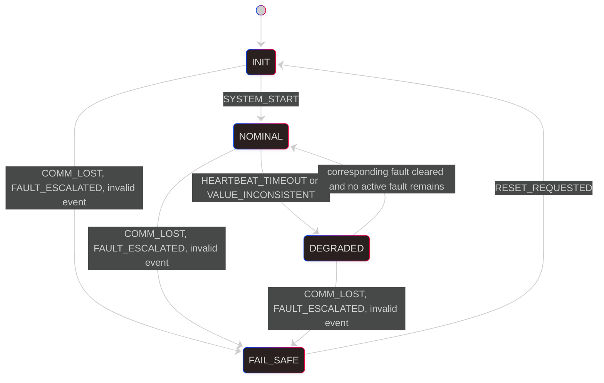

# Sentinel v0.1 State Machine Contract

## Purpose

This document defines the canonical operating state machine contract for Sentinel v0.1.

It is the normative source for state, event, fault, recovery, and escalation behavior. The worker implementation, tests, supervisor simulator, state diagram, and fault matrix must conform to this contract.

Sentinel v0.1 is currently an off-target C prototype. This document defines the behavior to implement and does not claim that STM32 firmware, CAN transport, dual-controller coordination, or Raspberry Pi supervision already exists.

## Contract boundaries

The state machine receives qualified domain events. It does not receive raw CAN frames, timestamps, counters, or GPIO samples directly.

Detection components are responsible for:
- validating raw observations
- applying timeout and persistence rules
- producing qualified `SentinelEvent` values
- preventing stale observations from being reported as current health

The state machine is responsible for:
- tracking the current operating state
- tracking active faults
- applying deterministic transition rules
- preventing unsafe automatic recovery
- exposing enough information for a supervisor trace

Timing and persistence policy remain outside the pure transition function. Repeating the same fault event does not, by itself, mean that the fault has escalated.

## Operating states

Sentinel v0.1 uses four required states:
- `INIT`
- `NOMINAL`
- `DEGRADED`
- `FAIL_SAFE`

### `INIT`

The worker is starting or resetting.

Expected behavior:
- initialize local state and fault tracking
- initialize the communication path
- keep safety-related outputs in their safe default condition
- wait for baseline checks before accepting `SYSTEM_START`

`SYSTEM_START` may be emitted only after startup checks confirm that nominal operation is allowed. Normal operation must not be enabled while the worker remains in `INIT`.

### `NOMINAL`

The worker is operating normally.

Expected conditions:
- local worker health is valid
- the peer heartbeat is fresh
- the peer value or state is coherent
- the communication path is valid
- no active fault requires degraded or fail-safe behavior

This is the only normal operating state.

### `DEGRADED`

The worker detected an abnormal condition, but controlled reduced operation remains possible.

Expected behavior:
- the triggering fault remains active until explicitly cleared
- reduced operation is intentional and defined
- entry, recovery, and escalation are externally observable
- a repeated fault notification does not automatically cause escalation
- recovery to `NOMINAL` is allowed only when no active fault remains

### `FAIL_SAFE`

The worker detected a condition that is no longer acceptable for controlled operation.

Expected behavior:
- normal operation is disabled
- safety-related outputs remain in their safe condition
- the cause of entry remains observable
- health recovery events cannot unlock the state
- only `RESET_REQUESTED` can return the worker to `INIT`

An invalid current state, an invalid event, or an unrecognized event must lead to `FAIL_SAFE`.

## Event model

Events are qualified observations or control decisions. They are not raw transport messages.

| Event | Producer | Meaning | Fault effect |
|---|---|---|---|
| `SYSTEM_START` | Startup coordinator | Baseline startup checks completed successfully | No fault change |
| `HEARTBEAT_TIMEOUT` | Heartbeat monitor | No valid peer heartbeat was observed within the configured deadline | Activates `HEARTBEAT_LOST` |
| `HEARTBEAT_OK` | Heartbeat monitor | A valid and sufficiently fresh peer heartbeat has been confirmed | Clears `HEARTBEAT_LOST` |
| `VALUE_INCONSISTENT` | Peer consistency monitor | The peer value or state conflicts with the accepted local view | Activates `INCOHERENT_PEER_STATE` |
| `VALUE_OK` | Peer consistency monitor | Peer value or state coherence has been confirmed | Clears `INCOHERENT_PEER_STATE` |
| `COMM_LOST` | Communication monitor | The required exchange path is unavailable or no longer trustworthy | Activates `COMMUNICATION_LOST` |
| `COMM_OK` | Communication monitor | The required exchange path has been validated as operational | Clears `COMMUNICATION_LOST` |
| `FAULT_ESCALATED` | Fault policy component | An active fault exceeded its persistence, severity, or compatibility limit | No new fault; escalates current active fault context |
| `RESET_REQUESTED` | Authorized reset source | An explicit reset has been requested | Fault tracking is reinitialized on entry to `INIT` |
| `INVALID` or unrecognized value | API boundary or validation failure | The event is not a valid qualified input | No recoverable fault mapping; forces `FAIL_SAFE` |

### Event repetition

Fault events may be repeated by their producer. Repetition refreshes or confirms the associated active fault, but it does not implicitly produce `FAULT_ESCALATED`.

The fault policy component produces `FAULT_ESCALATED` only when an explicit rule is satisfied, for example:
- a fault remains active beyond a defined duration
- a severity threshold is reached
- the combination of active faults is incompatible with degraded operation

Exact timing thresholds belong to the detector or fault policy configuration, not to the pure state transition table.

## Active fault model

The worker must be able to represent the active status of the three mandatory v0.1 faults:
- `HEARTBEAT_LOST`
- `COMMUNICATION_LOST`
- `INCOHERENT_PEER_STATE`

Fault activation and clearing are independent:

| Event | Active fault update |
|---|---|
| `HEARTBEAT_TIMEOUT` | Set `HEARTBEAT_LOST` active |
| `HEARTBEAT_OK` | Clear `HEARTBEAT_LOST` |
| `VALUE_INCONSISTENT` | Set `INCOHERENT_PEER_STATE` active |
| `VALUE_OK` | Clear `INCOHERENT_PEER_STATE` |
| `COMM_LOST` | Set `COMMUNICATION_LOST` active |
| `COMM_OK` | Clear `COMMUNICATION_LOST` |

An `*_OK` event clears only its corresponding fault. It must not clear unrelated faults.

Recovery from `DEGRADED` to `NOMINAL` occurs after processing a recovery event only when the active fault set becomes empty. A worker degraded by heartbeat loss therefore requires `HEARTBEAT_OK`, not unrelated `VALUE_OK` and `COMM_OK` confirmations.

Events received before a fault becomes active must not be cached as proof of a future recovery.

## Communication loss policy

`COMM_LOST` represents loss of the required exchange path, not a single delayed heartbeat. Because Sentinel relies on peer cross-monitoring, operation without a trustworthy communication path is not accepted in v0.1.

The required response is therefore:

| Current state | Next state |
|---|---|
| `INIT` | `FAIL_SAFE` |
| `NOMINAL` | `FAIL_SAFE` |
| `DEGRADED` | `FAIL_SAFE` |
| `FAIL_SAFE` | `FAIL_SAFE` |

`COMM_OK` does not unlock `FAIL_SAFE`. An explicit reset remains required.

## Transition matrix

The following matrix defines every valid state and event combination. "Remain" means that the operating state does not change, although the associated active fault may be updated as defined above.

### From `INIT`

| Event | Next state | Reason |
|---|---|---|
| `SYSTEM_START` | `NOMINAL` | Startup coordinator confirms that all baseline checks are valid |
| `HEARTBEAT_TIMEOUT` | Remain `INIT` | Startup remains inhibited while heartbeat health is invalid |
| `HEARTBEAT_OK` | Remain `INIT` | Health information may clear its fault, but cannot start the system |
| `VALUE_INCONSISTENT` | Remain `INIT` | Startup remains inhibited while peer information is incoherent |
| `VALUE_OK` | Remain `INIT` | Coherence may be restored, but cannot start the system |
| `COMM_LOST` | `FAIL_SAFE` | Required exchange cannot be established or trusted |
| `COMM_OK` | Remain `INIT` | Communication recovery alone cannot start the system |
| `FAULT_ESCALATED` | `FAIL_SAFE` | Startup detected an unacceptable persistent or severe fault |
| `RESET_REQUESTED` | Remain `INIT` | The worker is already in the reset/startup state |
| `INVALID` or unrecognized event | `FAIL_SAFE` | Invalid input must not be silently ignored |

### From `NOMINAL`

| Event | Next state | Reason |
|---|---|---|
| `SYSTEM_START` | Remain `NOMINAL` | A duplicate start event has no operational effect |
| `HEARTBEAT_TIMEOUT` | `DEGRADED` | Peer freshness is invalid, but controlled reduced operation may remain possible |
| `HEARTBEAT_OK` | Remain `NOMINAL` | Heartbeat health remains valid |
| `VALUE_INCONSISTENT` | `DEGRADED` | Peer disagreement requires controlled reduced operation |
| `VALUE_OK` | Remain `NOMINAL` | Peer information remains coherent |
| `COMM_LOST` | `FAIL_SAFE` | Required cross-monitoring is unavailable |
| `COMM_OK` | Remain `NOMINAL` | Communication remains valid |
| `FAULT_ESCALATED` | `FAIL_SAFE` | Normal operation is no longer acceptable |
| `RESET_REQUESTED` | Remain `NOMINAL` | Reset is accepted only from `FAIL_SAFE` in v0.1 |
| `INVALID` or unrecognized event | `FAIL_SAFE` | Invalid input must not preserve normal operation |

### From `DEGRADED`

| Event | Next state | Reason |
|---|---|---|
| `SYSTEM_START` | Remain `DEGRADED` | A start event cannot override an active fault |
| `HEARTBEAT_TIMEOUT` | Remain `DEGRADED` | Confirms `HEARTBEAT_LOST`; repetition is not implicit escalation |
| `HEARTBEAT_OK` | `NOMINAL` if no active fault remains, otherwise remain `DEGRADED` | Clears only `HEARTBEAT_LOST` |
| `VALUE_INCONSISTENT` | Remain `DEGRADED` | Confirms `INCOHERENT_PEER_STATE`; repetition is not implicit escalation |
| `VALUE_OK` | `NOMINAL` if no active fault remains, otherwise remain `DEGRADED` | Clears only `INCOHERENT_PEER_STATE` |
| `COMM_LOST` | `FAIL_SAFE` | Required cross-monitoring is unavailable |
| `COMM_OK` | `NOMINAL` if no active fault remains, otherwise remain `DEGRADED` | Clears only `COMMUNICATION_LOST`; normally cannot unlock a prior fail-safe entry |
| `FAULT_ESCALATED` | `FAIL_SAFE` | Explicit fault policy rejects continued degraded operation |
| `RESET_REQUESTED` | Remain `DEGRADED` | Reset is accepted only from `FAIL_SAFE` in v0.1 |
| `INVALID` or unrecognized event | `FAIL_SAFE` | Invalid input is unsafe while already degraded |

### From `FAIL_SAFE`

| Event | Next state | Reason |
|---|---|---|
| `SYSTEM_START` | Remain `FAIL_SAFE` | Startup cannot bypass the fail-safe lock |
| `HEARTBEAT_TIMEOUT` | Remain `FAIL_SAFE` | Additional fault information cannot unlock fail-safe |
| `HEARTBEAT_OK` | Remain `FAIL_SAFE` | Health recovery cannot unlock fail-safe |
| `VALUE_INCONSISTENT` | Remain `FAIL_SAFE` | Additional fault information cannot unlock fail-safe |
| `VALUE_OK` | Remain `FAIL_SAFE` | Health recovery cannot unlock fail-safe |
| `COMM_LOST` | Remain `FAIL_SAFE` | Communication remains unavailable |
| `COMM_OK` | Remain `FAIL_SAFE` | Communication recovery cannot unlock fail-safe |
| `FAULT_ESCALATED` | Remain `FAIL_SAFE` | The worker is already in its safe locked state |
| `RESET_REQUESTED` | `INIT` | Explicit reset reinitializes state and fault tracking |
| `INVALID` or unrecognized event | Remain `FAIL_SAFE` | Fail-safe remains the safe destination |

### Invalid current state

An invalid or unrecognized current state transitions to `FAIL_SAFE` for every event, including `RESET_REQUESTED`.

## Mermaid diagram

The diagram shows state-changing paths only. Self-transitions and active fault updates remain defined by the transition matrix.

## Observable transition contract

Every state change must be representable in an external trace with at least:
- worker identifier
- event
- associated fault, when applicable
- previous state
- next state
- active fault set after processing
- detection or decision timestamp supplied by the caller

The supervisor is an observer. It must not become the sole owner of worker safety decisions.

## Required properties

The state machine must be:
- deterministic for a given state, event, and active fault set
- small enough to review exhaustively
- shared by both workers
- externally observable through logs or traces
- strict about invalid states and invalid events
- independent of STM32 HAL, CAN drivers, and supervisor implementation

## Forbidden behavior

Sentinel v0.1 must not allow:
- silent entry into degraded or fail-safe behavior
- normal operation during `INIT`
- automatic recovery from `FAIL_SAFE`
- recovery from `DEGRADED` while any fault remains active
- one health event to clear an unrelated fault
- stale health events to count as future recovery evidence
- implicit escalation caused only by repeated delivery of the same event
- communication loss to remain in `INIT`, `NOMINAL`, or `DEGRADED`
- invalid states or events to preserve normal operation

## Implementation alignment status

At the time this contract was established, the `feat/sentinel-event-core` implementation did not yet fully conform:
- `FAULT_ESCALATED` was not present in `SentinelEvent`
- `COMM_LOST` remained in `INIT` and entered `DEGRADED` from `NOMINAL`
- any repeated fault event in `DEGRADED` entered `FAIL_SAFE`
- recovery required all three `*_OK` events regardless of the triggering fault
- recovery flags were cached rather than derived from active faults
- invalid events in valid states were silently ignored

These are implementation gaps to resolve, not alternative policies.

## Done criteria

This contract is implemented when:
- the event enum and event strings match this document
- the worker tracks the three active faults explicitly
- all state/event combinations are covered by tests
- recovery tests cover each fault independently and in combination
- repeated fault events do not implicitly escalate
- `FAULT_ESCALATED` has an explicit tested path
- `COMM_LOST` enters `FAIL_SAFE` from every non-fail-safe state
- invalid state and invalid event behavior is tested
- the simulator uses the same events and the context-aware worker API
- the fault matrix and README reference this contract without contradicting it
