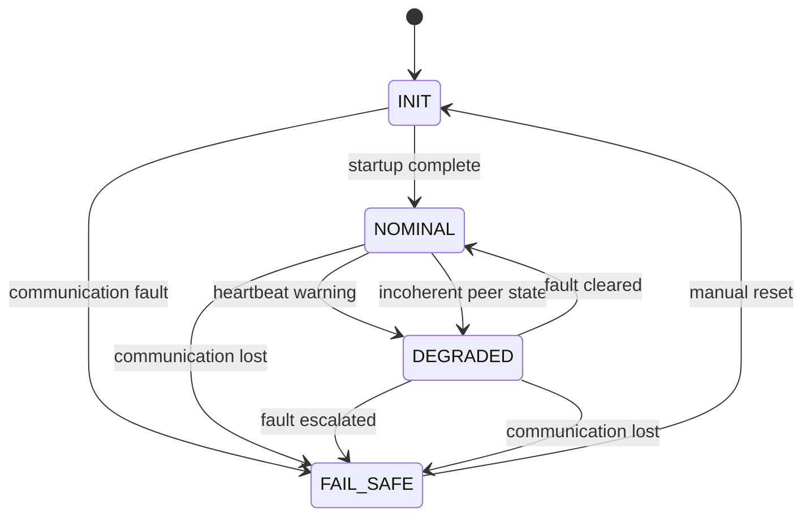

# Sentinel v0.1 State Machine

## Purpose

This document defines the minimal operating state machine for Sentinel v0.1.

The goal is to make system behavior explicit and reviewable. A fault-aware embedded system should not drift into undefined behavior when something abnormal happens.

## Operating states

Sentinel v0.1 uses four required states:

- `INIT`
- `NOMINAL`
- `DEGRADED`
- `FAIL_SAFE`

## State definitions

### INIT

The system is starting or resetting.

Expected behavior:

- initialize local state
- initialize communication
- assume unsafe outputs by default
- wait for enough valid information to enter nominal operation

The system must not enable normal operation while still in `INIT`.

### NOMINAL

The system is operating normally.

Expected behavior:

- local worker health is valid
- peer heartbeat is fresh
- peer state is coherent
- CAN exchange is valid
- no active fault requires degraded or fail-safe behavior

This is the only normal operating state.

### DEGRADED

The system detected abnormal behavior, but controlled reduced operation may still be possible.

Expected behavior:

- normal assumptions are no longer fully valid
- the system remains controlled
- the degraded condition is visible in logs or traces
- the system can recover to `NOMINAL` only if the fault clears according to explicit rules

`DEGRADED` must be intentional, not accidental.

### FAIL_SAFE

The system detected a condition that is no longer acceptable for controlled operation.

Expected behavior:

- normal operation is disabled
- unsafe outputs remain disabled
- the reason for entry is visible
- recovery requires an explicit reset or recovery policy

`FAIL_SAFE` is the default destination for undefined or unsafe conditions.

## Transition table

| Current state | Event | Next state | Reason |
|---|---|---|---|
| `INIT` | Startup complete and baseline checks valid | `NOMINAL` | System has enough valid information to operate |
| `INIT` | Communication fault | `FAIL_SAFE` | Startup cannot establish required exchange |
| `NOMINAL` | Heartbeat warning | `DEGRADED` | Peer freshness is degraded but not yet fatal |
| `NOMINAL` | Incoherent peer state | `DEGRADED` | Peer disagreement must be handled explicitly |
| `NOMINAL` | Communication lost | `FAIL_SAFE` | Required exchange is no longer available |
| `DEGRADED` | Fault cleared | `NOMINAL` | The abnormal condition has been resolved |
| `DEGRADED` | Fault escalated | `FAIL_SAFE` | Controlled degraded operation is no longer acceptable |
| `DEGRADED` | Communication lost | `FAIL_SAFE` | Required exchange is no longer available |
| `FAIL_SAFE` | Manual reset | `INIT` | Recovery must be explicit |

## Mermaid diagram

## Required properties

The state machine must be:

- deterministic
- small enough to review
- shared by both workers
- externally observable through logs or traces
- strict about unknown conditions

## Forbidden behavior

Sentinel v0.1 must not allow:

- silent transition into degraded behavior
- undocumented recovery from fail-safe
- ambiguous fault response
- normal operation during `INIT`
- automatic recovery from `FAIL_SAFE` without explicit policy

## Done criteria

This state machine is acceptable when:

- every state has a clear role
- every mandatory fault maps to a transition path
- `DEGRADED` and `FAIL_SAFE` are visible from the outside
- undefined or unsafe events do not lead to silent normal behavior
